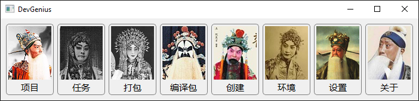

# DevGenius

DevGenius （开发精灵）是一款针对作者当前开发任务的开发辅助工具。

## 主要功能

截止到 2022 年 11 月 27 日凌晨，设计主要包含以下 6 项功能：

- 项目：查看、管理项目在本地的几个仓库
- 任务：管理与使用者相关的任务，与任务相关的分支、代码、编译包等
- 打包：将软件编译输出制作成压缩包，添加元数据，并存储在本地或 FTP 服务器上
- 编译包：管理 FTP 服务器上的编译包
- 创建：按要求创建 h 文件、cpp 文件或 ui 文件
- 环境：切换软件包的运行环境

## 配置开发环境

1. 从官网下载并安装 Python3 （作者使用 3.11 版本）。
2. 安装 `pipenv` 虚拟环境。
3. 拉取仓库。
4. 安装依赖。
5. 点击根目录下 `start.bat` 运行程序。
